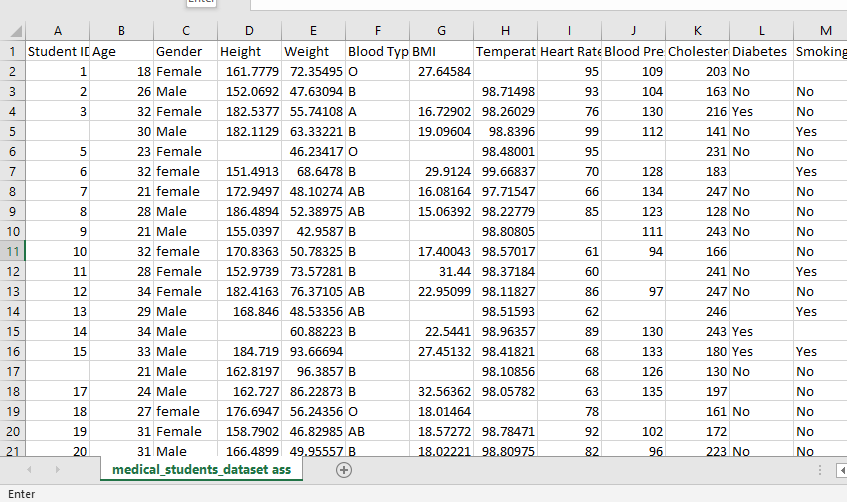
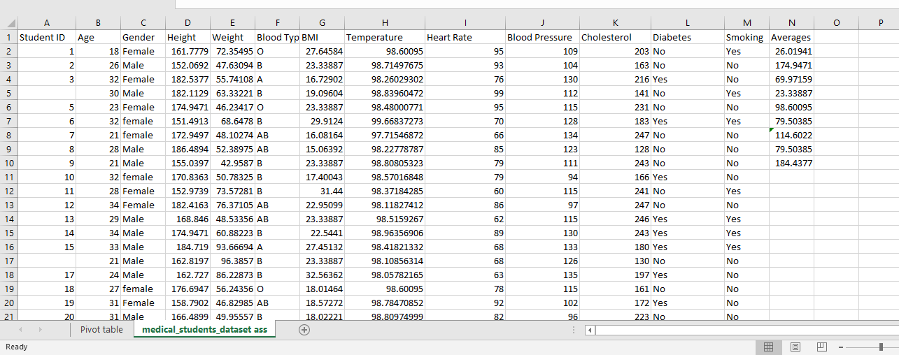
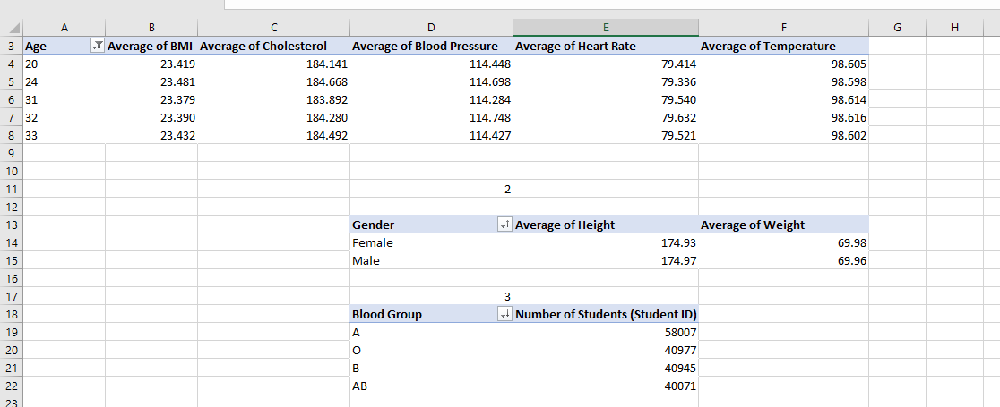
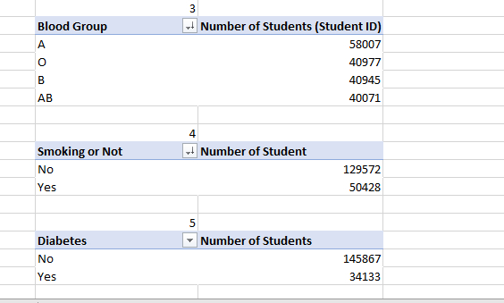
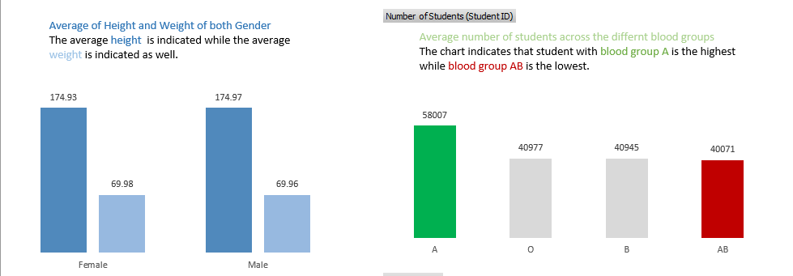
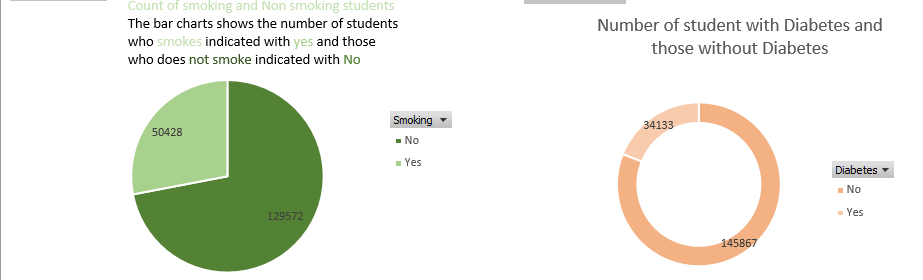

# Pivot-Tables-and-Data-Visualization

## INTRODUCTION

Second week of the bootcamp we discussed pivot tables.
pivot table is of the powerful function in excel that is used to analyze, summarize and manipulate large set of data quickly and it is interactive and easy to derive inferences from data set. some of the key features of pivot table include,
-  Data Summerization
-  Dynamic Layout
-  Filtering and Sorting
-  Calculated Fields
-  Grouping Categorization
## TASK

we were given a medical data set to analyze using pivot table and the question includes the following.
- Average value of the following Male and Females (Age,BMI,Temperature,Heart rate and Cholestrol)
- Average Height and Weight for both Genders (in 2 decimal Places)
- Number of students across different blood groups
- Number of students who smokes and those who does not
- Number of students who has Diabetes and those who does not

## SKILLS CONCEPT ADOPTED
 
  The skills use in answering the question include
  1. Basic excel function such as Average function, Sum Function, Count Function
  2. Pivot table Field
  3. Filter and sorting
  4. Conditional formatting
     
 ## SOLUTION TO THE TASK
 
 The data provided contain numerous empty cells and the average of the numeric column was calculated and used to fill the empty while assumption were made for the categorized data.
For the First question
The gender column was draggged into the row field since it is quantitative data while Age, BMI, Temperature,Heart Rate and cholestrol dragged into the value field because it is a quantitave data in the pivot table field . The **AVERAGE FUNCTION** was used for the required column since we were asked to calculate the average.The answer was sorted for both male and female.

For The Second question
Since the average weight and height was is required the **AVERAGE FUNCTION** was used with Gender in the row and weight and height in the value field. The answer was formatted to 2 decimal places.

For The Third question
The question asked requires knowing the number of students hence the **COUNT FUNCTION** was explored with the number of students in the value field since the column contain numbers while blood group in the row since it contain letter.

for The Forth and Fifth question
Both questions are similiar to the third question because it involves knowing the number of students who smokes and those who dont for the forth question while the fifth question requires number of students with and without diabetes.Thus the **COUNT FUNCTION** is the appropriate function.
The smoking header was clicked and it alligned to the row field while number of student (student ID) alligned to the value field, the count function summarized the values and the answer was sorted from descending to ascending order.
Similar operation was explored for the fifty question with the number of students without diabetes provided and those with diabetes also known.the answer was sorted. 

## RAW DATA

## CLEAN DATA

## PIVOT TABLES

## PIVOT TABLE VISUALIZATION

## CONCLUSION
It could be deduced that the pivot table is an excel function that should be used for quick and easy manipulation and transformation of data set.

 
